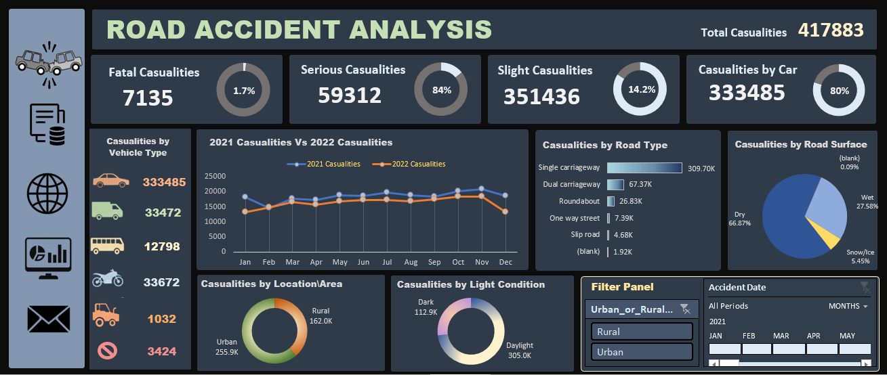

# Road Accident Analysis

## Project Overview
This project provides an in-depth analysis of road accidents. By leveraging pivot tables, dashboards, and data visualization techniques, it uncovers key insights into accident trends, vehicle involvement, and high-risk areas. 

## 📁 Repository Structure

```
Road_Accident_Analysis/
│
├── 📂 Presentation/
│   └── Road_Accident_Analysis_Presentation.pdf  # PDF version of the PowerPoint presentation
│
├── 📂 Dashboard/
│   ├── pivot_table_sheets.pdf                   # All pivot tables used in the analysis
│   ├── road_accident_dashboard.xlsb             # Final interactive dashboard
│   ├── road_accident_dashboard_screenshot.png   # Preview of the dashboard
│
├── 📂 Resources/
│   ├── references.md                            # List of resources and tutorials referenced
│   ├── raw_dataset/
│   │   ├── Road_Accident_2021_data.xlsx
│   │   ├── Road_Accident_2022_data.xlsx
│   ├── cleaned_dataset.xlsx                     # Processed dataset used for analysis


```

## 🛠 Tools Used
- **Microsoft Excel**: Data cleaning, pivot tables, and dashboard visualization
- **PowerPoint**: Presentation of key findings
---
Here’s the visual representation of the Road accident analysis
## Road Accident Dashboard


## 📊 Key Insights
- Accident trends analyzed by year, location, and vehicle type
- Impact of road conditions and weather on accidents
- Identification of high-risk areas and accident-prone timings

## 📜 License
This project is open-source and available under the [MIT License](LICENSE).

## 🤝 Suggestions & Collaboration
Have any insights, suggestions, or want to collaborate?

Feel free to:
- Raise an issue
- Contribute via pull requests
- Connect with me on LinkedIn

Let's explore the power of data together!
